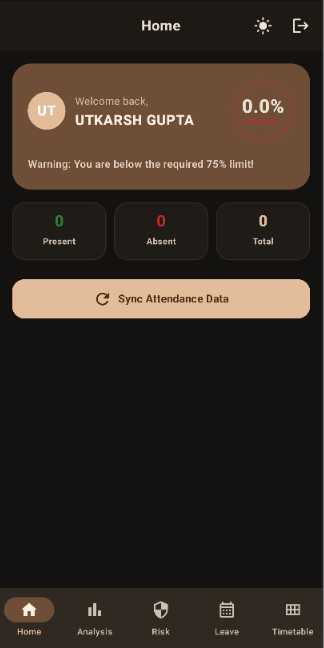
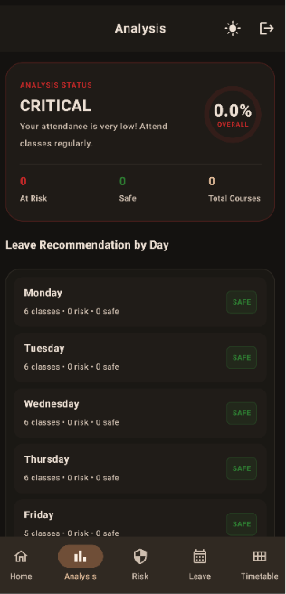
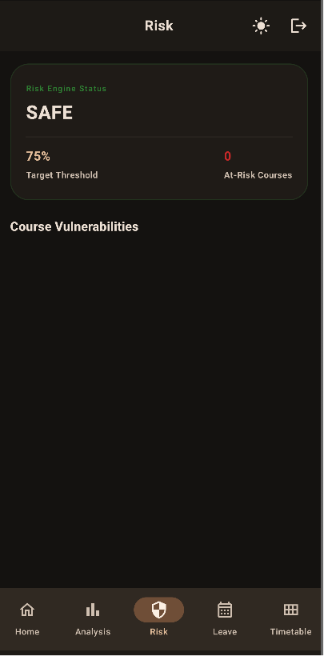
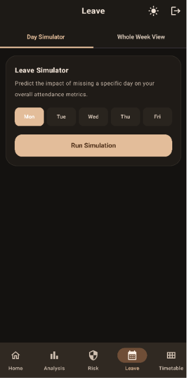
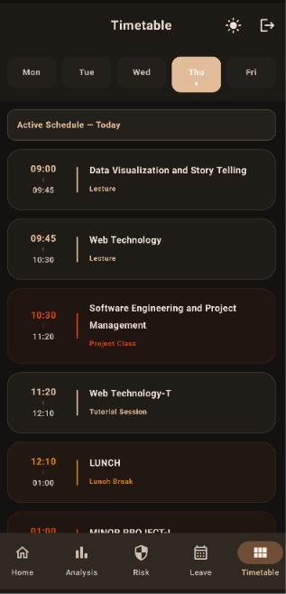

# LNCTU Attendance

An open-source Jetpack Compose Android app that fetches and displays your academic attendance and class schedule from the LNCTU portal, paired with premium Glance home screen widgets.

Default endpoint used: 

```
https://lnctu.vercel.app/attendance?username=&password=
```

## Features
* **Interactive Dashboard**: Modern Material 3 UI with course progress metrics, risk analysis, leave planner, and timetable viewer.
* **M3 Glance Home Screen Widgets**: 
  * **Attendance Widget**: Shows overall percentage and stats. Fully resizable (`SizeMode.Exact`) with custom translucent glassmorphism layouts.
  * **Timetable Widget**: Displays today's lectures in a scrollable list view.
  * **Live Syncing Status**: Immediate home screen visual feedback when syncing/refreshing.
* **Offline-First Cache**: Stores fetched attendance and timetable schedules in a local SQLite database to load instantly and fall back gracefully when offline.
* **🔐 Keystore AES-GCM Encryption**: User passwords are encrypted using hardware-backed cryptography via the `AndroidKeyStore` before local serialization.
* **⏰ Background Daily Alert Checks**: Utilizes system alarms to query attendance in the background daily at 9:00 AM, triggering high-priority alerts if course attendance drops below the 75% threshold.

## Architecture
Android App → Open-source API → LNCTU portal

API repository:
https://github.com/utkarshgupta188/lnctu

## Screenshots

| Home                          | Attendance Analysis                   |
|-------------------------------|---------------------------------------|
|  |  |

| Attendance Risk               | Leave Planner                   |
|-------------------------------|---------------------------------|
|  |  |

| Timetable                               |
|-----------------------------------------|
|  |

## Disclaimer
This project is not affiliated with LNCT University.
